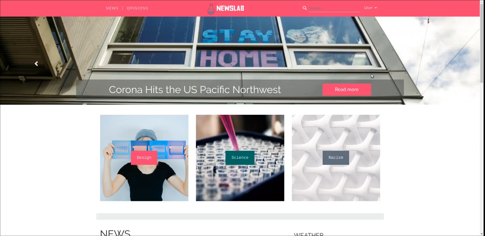

# A10: Presentation (Collaborative News)
 

Our product is called NewsLab. It consists of a collaborative news web application where anyone has the freedom to write and develop news about various topics and read about occurrences all around the world, serving as a platform not only to increase each one's awareness and knowledge about the world but also as a way to unite people and increase communication. It will be designed to create an all-encompassing place where people can write and discuss news in a collaborative manner, centralizing news and perspectives from all over the world allowing users to create a wholesome outlook on whatever subject they like.

This artifact contains a short product presentation followed by a short video where we present the main features of the project. We also make the assessment of the contribution of each team member for the project.

## 1. Product presentation

Our platform supports the main features needed for **publishing** and **reading** news. We also want to promote discussion and feedback, as such, we also allow **commenting** on posts, replying to comments, and **ratings** (like or dislike) both on posts and comments. The user may also **save posts** that he wishes to read later on and may **subscribe** to users and tags so that he stays updated on the current events. The platform's users may **search** for posts using several criteria such as the post's rating, publication date, etc.. On a user's **profile** he may check it's comments, posts, likes, statistics, as well as the **badges** that he has already earned. These badges are an incentive for users to do good contributions to the platform. On the administration side of the website, users have the possibility to **ban other users**, **review reports** that have been made by other users, and **delete inappropriate content**. 

URL to the product: http://lbaw2022.lbaw-prod.fe.up.pt  

## 2. Video presentation

[Link to the video](https://drive.google.com/open?id=1PmWI8VOI6TOnGeE1o9yfTqhfPmFHsiVM)

## 3. Contacts

* David Luís Dias da Silva, up201705373@fe.up.pt
* Eduardo Carreira Ribeiro, up201705421@fe.up.pt 
* Luís Pedro Pereira Lopes Mascarenhas Cunha, up201706736@fe.up.pt 
* Manuel Monge dos Santos Pereira Coutinho, up201704211@fe.up.pt

# Annex A: Group Self-Evaluation

All group members have worked in all the components.

The individual contribution of each member to the LBAW project, and considering all artifacts, is expressed in the following list:

* Group member 1 David Luís Dias da Silva, A
* Group member 2 Eduardo Carreira Ribeiro, A
* Group member 3 Luís Pedro Pereira Lopes Mascarenhas Cunha, A
* Group member 4 Manuel Monge dos Santos Pereira Coutinho, A

## Revision history
*No revisions yet*

***
GROUP2022, 07/06/2020
 
* David Luís Dias da Silva, up201705373@fe.up.pt
* Eduardo Carreira Ribeiro, up201705421@fe.up.pt 
* Luís Pedro Pereira Lopes Mascarenhas Cunha, up201706736@fe.up.pt (Editor)
* Manuel Monge dos Santos Pereira Coutinho, up201704211@fe.up.pt