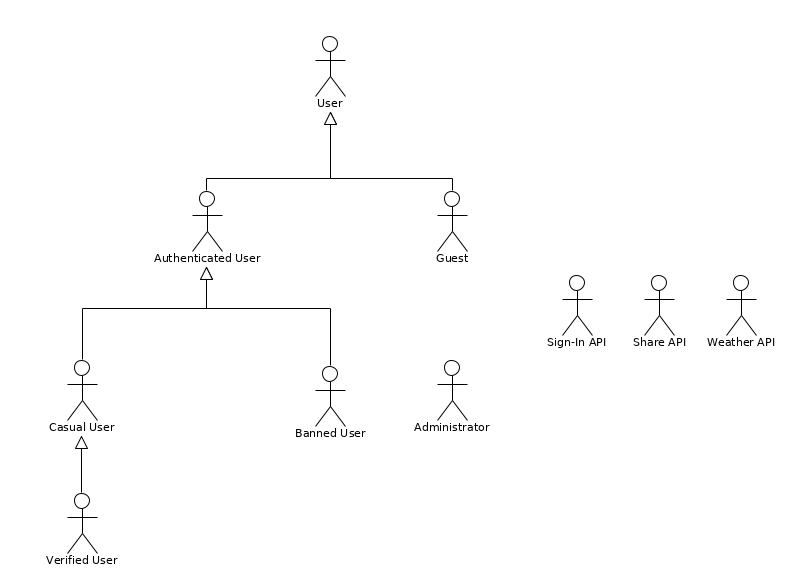

# A2: Actors and User stories (Collaborative News)

Our product is called NewsLab. It consists of a collaborative news web application where anyone has the freedom to write and develop news about various topics and read about occurrences all around the world, serving as a platform not only to increase each one's awareness and knowledge about the world but also as a way to unite people and increase communication. It will be designed to create an all-encompassing place where people can write and discuss news in a collaborative manner, centralizing news and perspectives from all over the world allowing users to create a wholesome outlook on whatever subject they like.

This artifact, containing the specification of the actors and user stories, serves as a description of the entities that interact with the system and the said interactions. Each actor's role is described and exemplified. The actor's interactions are presented in the form of user stories, well-described and prioritized, to support future development.
In the annex, non-functional requirements, such as business rules, technical requirements and restrictions, are specified.

## 1. Actors

In this section, all actors of the system are shown and their purpose explained.

Figure 1: Actor's diagram

|     Identifier     |                                                                                                                   Description                                                                                                                    |             Examples              |
|:------------------:|------------------------------------------------------------------------------------------------------------------------------------------------------------------------------------------------------------------------------------------------|:---------------------------------:|
|        User        | A general user is anyone that uses the site. It can belong to one of two categories: authenticated and non-authenticated (guest). A user can read and search for posts| n/a |
|       Guest        | A guest is an unauthenticated user that can sign-in or create an account. This type of user can't actively participate in the system (i.e. can't write articles of their own, comment or upvote items, etc.). | n/a  |
| Authenticated User | A user that is logged in and associated with a system account. It can be a casual (regular) user, a verified user or a banned user. | n/a |
| Casual User |  A normal user that is logged in. Can write posts and comments and interact with other users. | eduvidas |
|   Verified User    | Verified users earn their status by fulfilling accomplishments, granting them privileges, such as having higher priority posts (i. e. posts appear first in search results and are more likely to be suggested) and comments. | squarecunha |
|    Banned User     | A banned user is an authenticated user that has been suspended due to reports on their content (posts or comments), losing the writing privilege. | mcgun |
|   Administrator    | An administrator manages the system by removing inappropriate comments/posts and banning users(either temporarily or permanently). They also can analyze reports made by other users on content on the site. Moreover, they can promote other users to administrators. | metadias |
|    Sign-In API     | External API that allows registering or logging in to the system. | Google   Facebook   Twitter |
|     Share API      | External API that allows a user to share the post to the desired platform. | Facebook   Twitter |
|    Weather API     | Interface used to obtain the weather information on the user's location. | OpenWeather |

Table 1: Actors' description

## 2. User Stories

In this section, the user stories of the system are shown and explained. They are divided into sub-sections, each one containing the user stories relative to a certain actor of the system.

### 2.1. User

| Identifier |          Name          | Priority | Description |
|:----------:|:----------------------:|:--------:| ----------- |
|   US101    |       Read posts       |   high   | As a _User_, I want to read posts and news of other people, so that I keep track of what happens relative to my favorite subjects, and in the world in general. |
|   US102    |      See profiles      |   high   | As a _User_, I want to see user profiles so that I can know more information about them. |
|   US103    |     Read comments      |   high   | As a _User_, I want to read other people's comments on a certain post, so that I can understand other points of view and opinions.|
|   US104    |       See votes        |   high   | As a _User_, I want to see how many upvotes/downvotes a certain post/comment has, so that I can read the best posts and comments and understand what is popular and trending. |
| US105   | View post date | high | As a _User_, I want to view when a post was published, so that I know how current it is. |
| US106 | View comment date | high | As a _User_, I want to view when a comment was made, so that I avoid taking part in inactive discussions.  |
|   US107    |         Search         |   high   | As a _User_, I want to search for a specific post or profile, so that I can find in the app exactly what I'm looking for. |
|   US108    |         Filter         |   high   | As a _User_, I want to filter the posts that I see (e.g. by subject or by author), so that I can find the content that I'm interested in. |
|   US109    |     Frontpage posts    | high     | As a _User_, I want the front page to show me the most relevant posts, currently, so that I can see, at a glance, what is happening in the world. |
|   US110    |      Sort results      |   high   | As a _User_, I want to sort my search results, so that I can easily find the most recent or most popular posts. |
|   US111    |     Sort comments      |   medium   | As a _User_, I want to sort the comments of a certain post, so that I can easily find the most recent or most popular ones. |
|   US112    |    Read guidelines     |  medium  | As a _User_, I want to know the rules about what I can or can't post/comment, so that I maintain the consistency of the community.|
|   US113    | Share content with API |   low    | As a _User_, I want to share posts and comments of the app through a social media platform, so that I can show to my friends (and other people in general) contents of my interest, and interact with them. |
|   US114    |    Weather with API    |   low    | As a _User_, I want to check information about the weather forecast, so I can be more informed about it.|
|   US115    |    Check FAQ           |   low    | As a _User_, I want to check the frequently asked questions of the site, so that I can know more information about the site like the contact information of the administrators |
|   US116    |    Check if the content has been edited  | low | As a _User_, I want to be able to see that a comment or post has been edited since its original publishing so that I know that the post has changed since the last time I read it. |
|   US117    |  See content editions | low    | As a _User_, I want to see previous versions of a comment/post that has been edited so that I can see what were the changes since the last time I read it|
| US118 | Change themes | low | As a _User_, I want to change the color theme, so that I have a personalized and more comfortable reading experience. |

Table 2: User's user stories

### 2.2. Guest

| Identifier |            Name           | Priority | Description |
|:----------:|:-------------------------:|:--------:| ----------- |
|   US201    |          Sign-up          |   high   | As a _Guest_, I want to create an account in the system, so that I can become an authenticated user and take advantage of the full functionality of the application. |
|   US202    |           Login           |   high   | As a _Guest_, I want to log in the system using my credentials, so that I can be authenticated and use the application with my account.|
|   US203    |     Password recovery     |  medium  | As a _Guest_, I want to be able to reset/recover my password so that I don't lose access to my account if I forget my current password.|
|   US204    | Sign-up with external API |   low    | As a _Guest_, I want to register and create an account in the application using an external API (e.g. Google, Twitter) so that I can access privileged information and become an authenticated user. |
|   US205    |  Login with external API  |   low    | As a _Guest_, I want to log in to the system using an external API (e.g. Google, Twitter), so that I can be authenticated and use the application with my account. |

Table 3: Guest's user stories

### 2.3. Authenticated User

| Identifier |           Name           | Priority | Description |
|:----------:|:------------------------:|:--------:| ----------- |
|   US301    |         Log out          |   high   | As an _Authenticated User_, I want to be able to log out of my account so that I can manually end my session. |
|   US302    |    Subscribe subjects    |   high   | As an _Authenticated User_, I want to subscribe to my favorite subjects, so that I never lose an update on that topic. |
|   US303    |   Unsubscribe subjects   |   high   | As an _Authenticated User_, I want to unsubscribe certain subjects, so that I no longer receive updates on that topic. |
|   US304    | View subscribed subjects |   high   | As an _Authenticated User_, I want to view the posts I have subscribed to, so that I can access them more quickly. |
|   US305    |    Subscribe authors     |   high   | As an _Authenticated User_, I want to subscribe to my favorite authors, so that I keep up to date with their discoveries. |
|   US306    |   Unsubscribe authors    |   high   | As an _Authenticated User_, I want to unsubscribe authors, so that I no longer receive updates from those writers. |
|   US307    | View subscribed authors  |   high   | As an _Authenticated User_, I want to view the authors I have subscribed to, so that I can easily go to their profiles. |
|   US308    |     Personalize feed     |   high   | As an _Authenticated User_, I want to personalize my feed, so that my main page contains new articles that I find relevant/appealing. |
|   US309    |    Remove my comments    |   high   | As an _Authenticated User_, I want to remove my previous comments, so that those with which I don't agree with anymore are not shown with my name attached. |
|   US310    |     Remove my posts      |   high   | As an _Authenticated User_, I want to remove my previous posts, so that articles that I wrote and no longer agree with are not visible anymore. |
|   US311    |      Remove ratings      |   high   | As an _Authenticated User_, I want to remove the previous ratings that I gave to a post or comment, so that an assessment I disagree with no longer influences that content. |
|   US312    |       View profile       |   high   | As an _Authenticated User_, I want to view my own profile, so that I can check my information and what others can see about me (profile picture, username, ...). |
|   US313    |       Edit profile       |   high   | As an _Authenticated User_, I want to edit my profile, so that I can update my information (e.g. changing the password, changing the profile picture...). |
|   US314    |       Delete account       |   high   | As an _Authenticated User_, I want to delete my account, so that I can erase it from the system and delete the information about me. |
|   US315    |        Save posts        |  medium  | As an _Authenticated User_, I want to save posts that I have not finished reading, so that I don't lose them. |
|   US316    |    Remove saved post     |  medium  | As an _Authenticated User_, I want to remove a saved post, so that I can dismiss it. |
|   US317    |     View saved posts     |  medium  | As an _Authenticated User_, I want to view my favorite posts, so that I can continue reading them later. |
|   US318    |     View my comments     |  medium  | As an _Authenticated User_, I want to view all my comments, so that I can easily access and review them. |
|   US319    |     View my ratings      |  medium  | As an _Authenticated User_, I want to easily access the posts and articles that I rated, so that I can come back to them quickly. |
|   US320    |        Statistics        |  medium  | As an _Authenticated User_, I want to check the content statistics, so that I can analyze the performance of my posts. |
|   US321    |      Check badges      |   medium   | As an _Authenticated User_, I want to see what badges I have/haven't collected, so that I check my progress.|
|   US322    |      Notifications       |  medium  | As an _Authenticated User_, I want to be notified of new activity in my content, so that I can keep up with the feedback. |
|   US323    |    Make post private     |  medium  | As an _Authenticated User_, I want to make my post private, so that no one can see it except me. |

Table 4: Authenticated User's user stories

### 2.4. Casual User

| Identifier |          Name          | Priority | Description |
|:----------:|:----------------------:|:--------:| ----------- |
|   US401    |      Post article      |   high   | As a _Casual User_, I want to post an article, so that I can share news/opinions with other people. |
|   US402    |      Article tags      |   high   | As a _Casual User_, I want to choose the tags of the article I post, so that I can label its type and topic(s).|
|   US403    |     Comment posts      |   high   | As a _Casual User_, I want to comment on posts, so that I can give my opinion about them. |
|   US404    |   Reply to comments    |   high   | As a _Casual User_, I want to reply to a comment on a post, so that I can generate a discussion. |
|   US405    |      Rate a post       |   high   | As a _Casual User_, I want to like or dislike an article, so that I can give feedback about its quality. |
|   US406    |     Rate a comment     |   high   | As a _Casual User_, I want to like or dislike a comment, so that I can give feedback about its quality. |
|   US407    |     Report a post      |   high   |As a _Casual User_, I want to report a post, so that I can warn admins about problems with said post.|
|   US408    |    Report a comment    |   high   | As a _Casual User_, I want to report a comment, so that I can warn admins about problems with said comment.|
|   US409    |    Report a user    |   high   | As a _Casual User_, I want to report a user, so that I can warn admins about problems with said user like an inappropriate profile picture. |
|   US410    |    Report a tag    |   high   | As a _Casual User_, I want to report a tag, so that I can warn admins about problems with said tag like an inappropriate name. |
|   US411    |     Title article      |   high   | As a _Casual User_, I want to give a title to my articles, so that other readers can know that the article is about. |
|   US412    |      Earn badges       |   high   | As a _Casual User_, I want to receive badges based on certain achievements, so that I am motivated to keep using the system and follow the guidelines.   |
|   US413    |      Get verified      |   high   | As a _Casual User_, I want to get promoted to a verified user when I get all badges, so that I am rewarded for my efforts. |
|   US414    |  Use images on posts   |  medium  | As a _Casual User_, I want to use images on my posts, so that I may have a more complete article. |
|   US415    |     Edit comments      |  medium  | As a _Casual User_, I want to edit my comments, so that I can fix content or grammar mistakes. |
|   US416    |       Edit posts       |  medium  | As a _Casual User_, I want to edit my posts, so that I can fix content or grammar mistakes. |
|   US417    |    Preview article     |  medium  | As a _Casual User_, I want to preview the article I'm writing, so that I can make sure my article is well formatted before publishing it. |
|   US418    |   Badge notification   |  medium  | As a _Casual User_, I want to get notified when I win a badge, so that I stay updated with my progress. |
|   US419    |    Make post public   |  medium  | As a _Casual User_, I want to make my posts public, so that everyone can read them. |
|   US420    |    Schedule posting   |  medium  | As a _Casual User_, I want to schedule when my posts become public, so that I can write them in advance but publish them only when I want to. |
|   US421    |   Use text emphasis    |   low    | As a _Casual User_, I want to use text emphasis, such as bold, italics and underline, on my articles. |

Table 5: Casual User's user stories

### 2.5. Banned User
Note: The actual value of most of the banned user's user stories is provided to the rest of the users of the site and not to the banned user itself. Banning users that don't follow the community guidelines helps ensure a friendly and trustful collaborative news environment.

| Identifier |              Name               | Priority | Description |
|:----------:|:-------------------------------:|:--------:| ----------- |
|   US501    | Lose post writing ability      |   high   | As a _Banned User_, I expect to be unable to write posts, so that I am punished for violating the community guidelines.   |
|   US502    | Lose comment writing privilege |   high   | As a _Banned User_, I expect to be unable to write comments, so that I am punished for violating the community guidelines. |
|   US503    | Lose post-editing privilege     |   high   | As a _Banned User_, I expect to be unable to edit posts, so that I am punished for violating the community guidelines.   |
|   US504    | Lose comment editing privilege  |   high   | As a _Banned User_, I expect to be unable to edit comments, so that I am punished for violating the community guidelines.  |
|   US505    | Lose post rating privilege      |  medium  | As a _Banned User_, I expect to be unable to rate posts, so that I am punished for violating the community guidelines. |
|   US506    | Lose comment-rating privilege   |  medium  | As a _Banned User_, I expect to be unable to rate comments, so that I am punished for violating the community guidelines. |
|   US507    | Lose post reporting privilege   |  medium  | As a _Banned User_, I expect to be unable to report posts, so that I am punished for violating the community guidelines. |
|   US508    | Lose comment reporting privilege|  medium  | As a _Banned User_, I expect to be unable to report comments, so that I am punished for violating the community guidelines. |
|   US509    | Lose badge earning privilege    |  medium  | As a _Banned User_, I expect to be unable to earn badges, so that I am punished for violating the community guidelines. |
|   US510    |         Lose badges             |  medium  | As a _Banned User_, I expect to lose all badges I've earned, so that I am punished for violating the community guidelines. |
 
 Table 6: Banned User's user stories

### 2.6. Verified User

| Identifier |           Name          | Priority | Description |
|:----------:|:-----------------------:|:--------:| ----------- |
|   US601    |        Green tick       |   high   | As a _Verified User_, I want a green tick to be associated with my user profile, so that I can be easily identified as a verified user by others. |
|   US602    |    Priority in Posts    |  medium  | As a _Verified User_, I want my posts to be displayed first in search results, so that my content has priority compared to the content of non-verified users. |
|   US603    |  Priority in Comments   |  medium  | As a _Verified User_, I want my comments to be displayed first in a post, so that my content has priority compared to the content of non-verified users. |
|   US604    | More meaningful ratings |  medium  | As a _Verified User_, I want my upvotes and downvotes to be more meaningful than those of regular users, so that I have more influence compared to non-verified users and content moderation is predominantly done by trusted users. |

Table 7: Verified User's user stories

### 2.7. Administrator

| Identifier |           Name           | Priority | Description |
|:----------:|:------------------------:|:--------:| ----------- |
|   US701    |   Delete others' posts    |   high   | As an _Administrator_, I want to delete other people's posts, so that I remove offensive/inappropriate articles. |
|   US702    |  Delete others comments  |   high   | As an _Administrator_, I want to delete other people's comments, so that that I remove offensive/inappropriate remarks that they've done. |
|   US703    |      Review reports      |   high   | As an _Administrator_, I want to review reported comments and posts, so that I can check whether they are offensive or not. |
|   US704    |        Ban users         |   high   | As an _Administrator_, I want to ban users, so that they are prohibited from publishing content and are punished for their behavior on the application. |
|   US705    |   Ban users temporarily  |   high   | As an _Administrator_, I want to suspend users (i. e. ban temporarily), so that they are temporarily prevented from publishing and are punished for their misbehavior. |
|   US706    |   View banned users      |   high   | As an _Administrator_, I want to see a complete list of all banned users, so that I can better manage them. |
|   US707    |      Unban users         |   high   | As an _Administrator_, I want to unban users, so that users that have been banned for a while can get their privileges back. |
|   US708    | Promote to administrator |  medium  | As an _Administrator_, I want to promote other users to Administrator, so that they have privileges of this role. |
|   US709    |  Dismiss administrators  |  medium  | As an _Administrator_, I want to dismiss other Administrators, so that they lose the privileges of this role. |
|   US710    |    View administrators   |  medium  | As an _Administrator_, I want to see a complete list of all the Administrators, so that I can better manage them. |
|   US711    |       Send warning       |   low    | As an _Administrator_, I want to send warnings to the users, so that they are aware of their misconduct. |

Table 8: Administrator's user stories

## A1. Annex: Supplementary requirements

### A1.1. Business rules

The following table contains the most important business rules of our system. These rules define the behavior that is expected in some areas of the site such as how the deletion of comments, posts, and accounts should be handled externally and internally. They also set some guidelines for the behavior of admins and usage of the site.

| Identifier |         Name          | Description |
| ---------- | --------------------  | ----------- |
|    BR01    |     Verified users    | _Verified Users_ must have collected all badges before getting verified.  |
|    BR02    |        Post tags      | The contents of a post must respect the tags that are given to it. |
|    BR03    |      Banning users    | Only _Admins_ can ban other users. |
|    BR04    |    Rightful banning   | _User_ banishment must be done only in cases of continuous or serious violations of the community guidelines and not out of personal spite. |
|    BR05    |  Comment deletion     | When a comment is deleted by a user, its representation is seen as an empty comment with no user identification. This is done so that other comments dependent on it(replies) aren't affected by the deletion. The comments are also deleted from the database. |
|    BR06    |  Post deletion        | When a post is deleted by a user it no longer is visible to any user and it is also deleted from the database. All the comments associated with this post are also deleted. |
|    BR07    |  Account deletion     | When an account is deleted all of its comments and posts will hide its name from authorship but will remain in the database. |
|    BR08    |  Self-vote            | A user can't vote on its own comments or posts. |
|    BR09    |  Self-report          | A user can't report itself. |
|    BR10    |  Admin review own reports | An admin can analyze neither reports made on its posts/comments nor reports that were made by him. |
|    BR11    |  Vote count per user  | A user can only give one vote to each post/comment and it must be either a positive or negative vote (never both). |
|    BR12    |  Edited tag           | A post or comment that has been edited since its publication is tagged as such. |
|    BR13    | Minimum age           | The website should only be used by a person if it has more than 13 years of age. |
|    BR14    | Publish date          | The date a post is scheduled to be published must be later than the current one. |
|    BR15    | Default photos          | If a user or notification is not connected with a photo, they will have a default photo. The posts need to have a banner image. |
|    BR16    | Likes and dislikes of content          | The specific amount of likes and dislikes of a post or comment are only visible by admins, if that content is reported. In all other cases, only the like/dislike difference is visible. |
|    BR17    | Type of a post        | Each post has to belong to one of two types: "News" or "Opinion". |
|    BR18    | Number of tags in a post | A post needs to have between 1 and 3 tags. |

### A1.2. Technical requirements
Here are three technical requirements that we consider the ones that are most aligned with our product vision concerning technical aspects that the system must meet, such as availability, usability, and scalability. 

| Identifier |           Name           | Description |
|:----------:|:------------------------:| ----------- |
|    TR01    |       Availability       | The system must be available 99.5 percent of the time every day, to ensure that the user can post or read the latest news anytime. |
|    TR02    |         Usability       | The system must have an intuitive and simple interface design, suited for most screen resolutions. This property is important to allow the usage of the system in mobile devices, which is, currently, a large market. |
|    TR03    |        Scalability       | The system must be prepared to deal with the growth in the number of posts shared and possible users. |

### A1.3. Restrictions

Next are presented some restrictions that the project development must follow, such as meeting the delivery schedule and the team size.

| Identifier |           Name           | Description |
| ---------- | ------------------------ | ----------- |
| C01 |           Deadline           | The system should be ready to be used/delivered roughly around May, in order to meet the deadline of the project. |
| C02 |           Team size           | The system must be developed by a team of no more than four students |

## Revision history

* Added US409 - Report a user
* Fixed a duplicate US identifier (704). Now "US704- Ban users" and "US705 - Ban users temporarily" 
* Fixed US numbers from 308-310 (previously didn't exist)
* Added BR15 and BR16 as additional Business Rules for A4
* Added US410 - Report a tag
* Added BR17 and BR18 as additional Business Rules for A4

***
**GROUP2022, 27/02/2020**

* David Luís Dias da Silva, up201705373@fe.up.pt 
* Eduardo Carreira Ribeiro, up201705421@fe.up.pt (Editor)
* Luís Pedro Pereira Lopes Mascarenhas Cunha, up201706736@fe.up.pt
* Manuel Monge dos Santos Pereira Coutinho, up201704211@fe.up.pt