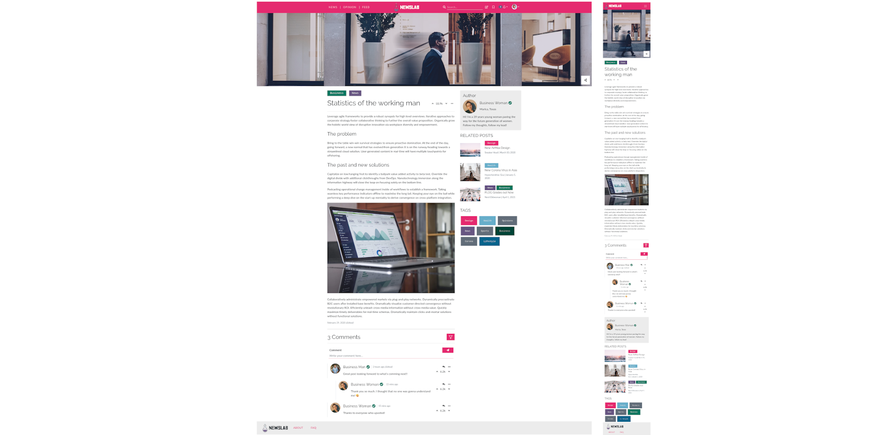

# A3: User Interface Prototype (Collaborative News)

Our product is called NewsLab. It consists of a collaborative news web application where anyone has the freedom to write and develop news about various topics and read about occurrences all around the world, serving as a platform not only to increase each one's awareness and knowledge about the world but also as a way to unite people and increase communication. It will be designed to create an all-encompassing place where people can write and discuss news in a collaborative manner, centralizing news and perspectives from all over the world allowing users to create a wholesome outlook on whatever subject they like.

The goal of this artifact is to provide the user with a preview of the end product to show the manifestation of the already defined requirements, as well as to explore the necessity of changing them (adding or removing). This early prototype enables the analysis and evolution of the final design.

The specification of the general interface of the proposed system is included in this artifact. This specification includes both the description of the interaction between the end-users and the website as well as it's general aesthetic design.

The following section includes an overview of the interface elements and their common features. The second section provides a map of the site, i.e. "the relationship between different pages". The final two sections have a description of the common interactions between the users and the system and depictions of the implemented interfaces.

## 1. Interface and common features

**Figure 1.** Front-page. The main common elements throughout the site can be observed on this page.

1- Logo
2- Header/Navbar
3- User center/dropdown
4- Page content
5- Search bar
6- Footer

The website is distinguished by its colorful-flat look. The site takes advantage of said look in order to color post-tags. This colorization aids regular users to identify the topics of posts at a glance.
The main means of navigation for users are in the navbar, through it a user may write a new post, view saved posts, check notifications and, through the designated dropdown, go to its profile, subscriptions box, and, in the case of an administrator, visit the "Admin Center".
The image below depicts the user dropdown. The "Sign up" and "Sign In" elements are the elements presented in this dropdown to the "Guest".

**Figure 2**- User dropdown

## 2. Sitemap

**Figure 3**- Site map

## 3. Storyboards

> [Original](https://git.fe.up.pt/lbaw/lbaw1920/lbaw2022/-/blob/master/docs/storyboards/sb-orig-admin.png)

**Figure 3.1**- Storyboard showcasing actions and screens related to the admin center

> [Original](https://git.fe.up.pt/lbaw/lbaw1920/lbaw2022/-/blob/master/docs/storyboards/sb-orig-edit.png)

**Figure 3.2**- Storyboard showcasing actions and screens related to the different versions of a post or comment

> [Original](https://git.fe.up.pt/lbaw/lbaw1920/lbaw2022/-/blob/master/docs/storyboards/sb-orig-about.png)

**Figure 3.3**- Storyboard showcasing actions and screens related to the footer and respective links

> [Original](https://git.fe.up.pt/lbaw/lbaw1920/lbaw2022/-/blob/master/docs/storyboards/sb-orig-user-actions.png)

**Figure 3.4**- Storyboard showcasing actions and screens related to the user's main options and activities

> [Original](https://git.fe.up.pt/lbaw/lbaw1920/lbaw2022/-/blob/master/docs/storyboards/sb-orig-auth.png)

**Figure 3.5**- Storyboard showcasing actions and screens related to the authentication process

> [Original](https://git.fe.up.pt/lbaw/lbaw1920/lbaw2022/-/blob/master/docs/storyboards/sb-orig-search.png)

**Figure 3.6**- Storyboard showcasing searching for content.

## 4. Interfaces

[UI01: Front-page](#I1)  
[UI02: Post](#I2)  
[UI03: Create/Edit post](#I3)  
[UI04: Comment versions](#I4)  
[UI05: Post versions](#I5)  
[UI06: User profile](#I6)  
[UI07: Edit profile](#I7)  
[UI08: Feed Page/ News Page / Opinions page](#I8)  
[UI09: Manage subscriptions](#I9)  
[UI10: Tag page](#I10)  
[UI11: Search results page](#I11)  
[UI12: Saved posts](#I12)  
[UI13: FAQ](#I13)  
[UI14: About](#I14)  
[UI15: Statistics](#I15)  
[UI16: Sign up and Sign in](#I16)  
[UI17: Password recovery](#I17)  
[UI18: Administrator center](#I18)  

### UI01: Front-page
> [Desktop Image](https://git.fe.up.pt/lbaw/lbaw1920/lbaw2022/-/blob/master/docs/front-page-desktop.png)
>
> [Mobile Image](https://git.fe.up.pt/lbaw/lbaw1920/lbaw2022/-/blob/master/docs/front-page-mobile.png)
>
> [Source Code](https://git.fe.up.pt/lbaw/lbaw1920/lbaw2022/-/blob/master/src/front_page.php)
>
> [Working version](http://lbaw2022-piu.lbaw-prod.fe.up.pt/pages/front_page.php)

### UI02: Post
>[Desktop Image](https://git.fe.up.pt/lbaw/lbaw1920/lbaw2022/-/blob/master/docs/post-desktop.png)
>
>[Mobile Image](https://git.fe.up.pt/lbaw/lbaw1920/lbaw2022/-/blob/master/docs/post-mobile.png)
>
>[Source Code](https://git.fe.up.pt/lbaw/lbaw1920/lbaw2022/-/blob/master/src/post.php)
>
> [Working version](http://lbaw2022-piu.lbaw-prod.fe.up.pt/pages/post.php)

### UI03: Edit/create post
>[Desktop Image](https://git.fe.up.pt/lbaw/lbaw1920/lbaw2022/-/blob/master/docs/editpost-desktop.png)
>
>[Mobile Image](https://git.fe.up.pt/lbaw/lbaw1920/lbaw2022/-/blob/master/docs/editpost-mobile.png)
>
>[Source Code](https://git.fe.up.pt/lbaw/lbaw1920/lbaw2022/-/blob/master/src/edit_post.php)
>
> [Working version](http://lbaw2022-piu.lbaw-prod.fe.up.pt/pages/edit_post.php)

### UI04: Comment versions
>[Desktop Image](https://git.fe.up.pt/lbaw/lbaw1920/lbaw2022/-/blob/master/docs/comment-version-desktop.png)
>
>[Mobile Image](https://git.fe.up.pt/lbaw/lbaw1920/lbaw2022/-/blob/master/docs/comment-version-mobile.png)
>
>[Source Code](https://git.fe.up.pt/lbaw/lbaw1920/lbaw2022/-/blob/master/src/dv-comment.php)
>
> [Working version](http://lbaw2022-piu.lbaw-prod.fe.up.pt/pages/dv-comment.php)
>

### UI05: Post versions
>[Desktop Image](https://git.fe.up.pt/lbaw/lbaw1920/lbaw2022/-/blob/master/docs/post-version-desktop.png)
>
>[Mobile Image](https://git.fe.up.pt/lbaw/lbaw1920/lbaw2022/-/blob/master/docs/post-version-mobile.png)
>
>[Source Code](https://git.fe.up.pt/lbaw/lbaw1920/lbaw2022/-/blob/master/src/dv-post.php)
>
> [Working version](http://lbaw2022-piu.lbaw-prod.fe.up.pt/pages/dv-post.php)

### UI06: User Profile
> [Desktop Image](https://git.fe.up.pt/lbaw/lbaw1920/lbaw2022/-/blob/master/docs/profile-desktop.png)
>
> [Mobile Image](https://git.fe.up.pt/lbaw/lbaw1920/lbaw2022/-/blob/master/docs/profile-mobile.png)
>
> [Source Code](https://git.fe.up.pt/lbaw/lbaw1920/lbaw2022/-/blob/master/src/profile.php)
>
> [Working version](http://lbaw2022-piu.lbaw-prod.fe.up.pt/pages/profile.php)

### UI07: Edit profile
> [Desktop Image](https://git.fe.up.pt/lbaw/lbaw1920/lbaw2022/-/blob/master/docs/editprofile-desktop.png)
>
> [Mobile Image](https://git.fe.up.pt/lbaw/lbaw1920/lbaw2022/-/blob/master/docs/editprofile-mobile.png)
>
> [Source Code](https://git.fe.up.pt/lbaw/lbaw1920/lbaw2022/-/blob/master/src/edit_profile.php)
>
> [Working version](http://lbaw2022-piu.lbaw-prod.fe.up.pt/pages/edit_profile.php)

### UI08: Feed Page/ News Page / Opinions page
> [Desktop Image](https://git.fe.up.pt/lbaw/lbaw1920/lbaw2022/-/blob/master/docs/news-opinion-feed-desktop.png)
>
> [Mobile Image](https://git.fe.up.pt/lbaw/lbaw1920/lbaw2022/-/blob/master/docs/news-opinion-feed-mobile.png)
>
> [Source Code](https://git.fe.up.pt/lbaw/lbaw1920/lbaw2022/-/blob/master/src/feed-news-opinions.php)
>
> [Working version](http://lbaw2022-piu.lbaw-prod.fe.up.pt/pages/feed-news-opinions.php)

### UI09: Manage subscriptions
>[Desktop Image](https://git.fe.up.pt/lbaw/lbaw1920/lbaw2022/-/blob/master/docs/subs-desktop.png)
>
>[Mobile Image](https://git.fe.up.pt/lbaw/lbaw1920/lbaw2022/-/blob/master/docs/subs-mobile.png)
>
>[Source Code](https://git.fe.up.pt/lbaw/lbaw1920/lbaw2022/-/blob/master/src/manage-subs.php)
>
> [Working version](http://lbaw2022-piu.lbaw-prod.fe.up.pt/pages/manage-subs.php)

### UI10: Tag page
> [Desktop Image](https://git.fe.up.pt/lbaw/lbaw1920/lbaw2022/-/blob/master/docs/tagpage-desktop.png)  
>
> [Mobile Image](https://git.fe.up.pt/lbaw/lbaw1920/lbaw2022/-/blob/master/docs/tagpage-mobile.png)  
>
> [Source Code](https://git.fe.up.pt/lbaw/lbaw1920/lbaw2022/-/blob/master/src/tag-page.php)  
>
> [Working version](http://lbaw2022-piu.lbaw-prod.fe.up.pt/pages/tag-page.php)

### UI11: Search results page
> [Desktop Image](https://git.fe.up.pt/lbaw/lbaw1920/lbaw2022/-/blob/master/docs/search-results.png)
>
> [Mobile Image](https://git.fe.up.pt/lbaw/lbaw1920/lbaw2022/-/blob/master/docs/search-results_r.png)
>
> [Source Code](https://git.fe.up.pt/lbaw/lbaw1920/lbaw2022/-/blob/master/src/search_results.php)
>
> [Working version](http://lbaw2022-piu.lbaw-prod.fe.up.pt/pages/search_results.php)

### UI12: Saved posts
> [Desktop Image](https://git.fe.up.pt/lbaw/lbaw1920/lbaw2022/-/blob/master/docs/saved-posts.png)
>
> [Mobile Image](https://git.fe.up.pt/lbaw/lbaw1920/lbaw2022/-/blob/master/docs/saved-posts_r.png)
>
> [Source Code](https://git.fe.up.pt/lbaw/lbaw1920/lbaw2022/-/blob/master/src/saved-posts.php)
>
> [Working version](http://lbaw2022-piu.lbaw-prod.fe.up.pt/pages/saved-posts.php)

### UI13: FAQ
> [Desktop Image](https://git.fe.up.pt/lbaw/lbaw1920/lbaw2022/-/blob/master/docs/faq-desktop.png)
>
> [Mobile Image](https://git.fe.up.pt/lbaw/lbaw1920/lbaw2022/-/blob/master/docs/faq-mobile.png)
>
> [Source Code](https://git.fe.up.pt/lbaw/lbaw1920/lbaw2022/-/blob/master/src/faq.php)
>
> [Working version](http://lbaw2022-piu.lbaw-prod.fe.up.pt/pages/faq.php)

### UI14: About
> [Desktop Image](https://git.fe.up.pt/lbaw/lbaw1920/lbaw2022/-/blob/master/docs/about-desktop.png)
>
> [Mobile Image](https://git.fe.up.pt/lbaw/lbaw1920/lbaw2022/-/blob/master/docs/about-mobile.png)
>
> [Source Code](https://git.fe.up.pt/lbaw/lbaw1920/lbaw2022/-/blob/master/src/about.php)
>
> [Working version](http://lbaw2022-piu.lbaw-prod.fe.up.pt/pages/about.php)

### UI15: Statistics
> [Desktop Image](https://git.fe.up.pt/lbaw/lbaw1920/lbaw2022/-/blob/master/docs/stats.png)
>
> [Mobile Image](https://git.fe.up.pt/lbaw/lbaw1920/lbaw2022/-/blob/master/docs/stats_r.png)
>
> [Source Code](https://git.fe.up.pt/lbaw/lbaw1920/lbaw2022/-/blob/master/src/stats.php)
>
> [Working version](http://lbaw2022-piu.lbaw-prod.fe.up.pt/pages/stats.php)

### UI16: Sign up and Sign in
> [Desktop Image](https://git.fe.up.pt/lbaw/lbaw1920/lbaw2022/-/blob/master/docs/sign-in.png)
>
> [Mobile Image](https://git.fe.up.pt/lbaw/lbaw1920/lbaw2022/-/blob/master/docs/sign-in_r.png)
>
> [Desktop Image](https://git.fe.up.pt/lbaw/lbaw1920/lbaw2022/-/blob/master/docs/sign-up.png)
>
> [Mobile Image](https://git.fe.up.pt/lbaw/lbaw1920/lbaw2022/-/blob/master/docs/sign-up_r.png)

### UI17: Password recovery
> [Desktop Image](https://git.fe.up.pt/lbaw/lbaw1920/lbaw2022/-/blob/master/docs/pass-recovery.png)
>
> [Mobile Image](https://git.fe.up.pt/lbaw/lbaw1920/lbaw2022/-/blob/master/docs/pass-recovery_r.png)

### UI18: Administrator Center
> [Desktop Image](https://git.fe.up.pt/lbaw/lbaw1920/lbaw2022/-/blob/master/docs/ac-desktop-1.png)
>
> [Mobile Image](https://git.fe.up.pt/lbaw/lbaw1920/lbaw2022/-/blob/master/docs/ac-mobile-1.png)
>
> [Desktop Image](https://git.fe.up.pt/lbaw/lbaw1920/lbaw2022/-/blob/master/docs/ac-desktop-2.png)
>
> [Mobile Image](https://git.fe.up.pt/lbaw/lbaw1920/lbaw2022/-/blob/master/docs/ac-mobile-2.png)
>
> [Desktop Image](https://git.fe.up.pt/lbaw/lbaw1920/lbaw2022/-/blob/master/docs/ac-desktop-3.png)
>
> [Mobile Image](https://git.fe.up.pt/lbaw/lbaw1920/lbaw2022/-/blob/master/docs/ac-mobile-3.png)
>
> [Desktop Image](https://git.fe.up.pt/lbaw/lbaw1920/lbaw2022/-/blob/master/docs/ac-desktop-4.png)
>
> [Mobile Image](https://git.fe.up.pt/lbaw/lbaw1920/lbaw2022/-/blob/master/docs/ac-mobile-4.png)
>
> [Working version](http://lbaw2022-piu.lbaw-prod.fe.up.pt/pages/admin_center.php)

## A1. Annexes

## Revision history

* Changed the pictures to reflect the designer's feedback

***
**GROUP2022, 27/02/2020**

* David Luís Dias da Silva, up201705373@fe.up.pt
* Eduardo Carreira Ribeiro, up201705421@fe.up.pt
* Luís Pedro Pereira Lopes Mascarenhas Cunha, up201706736@fe.up.pt (Editor)
* Manuel Monge dos Santos Pereira Coutinho, up201704211@fe.up.pt