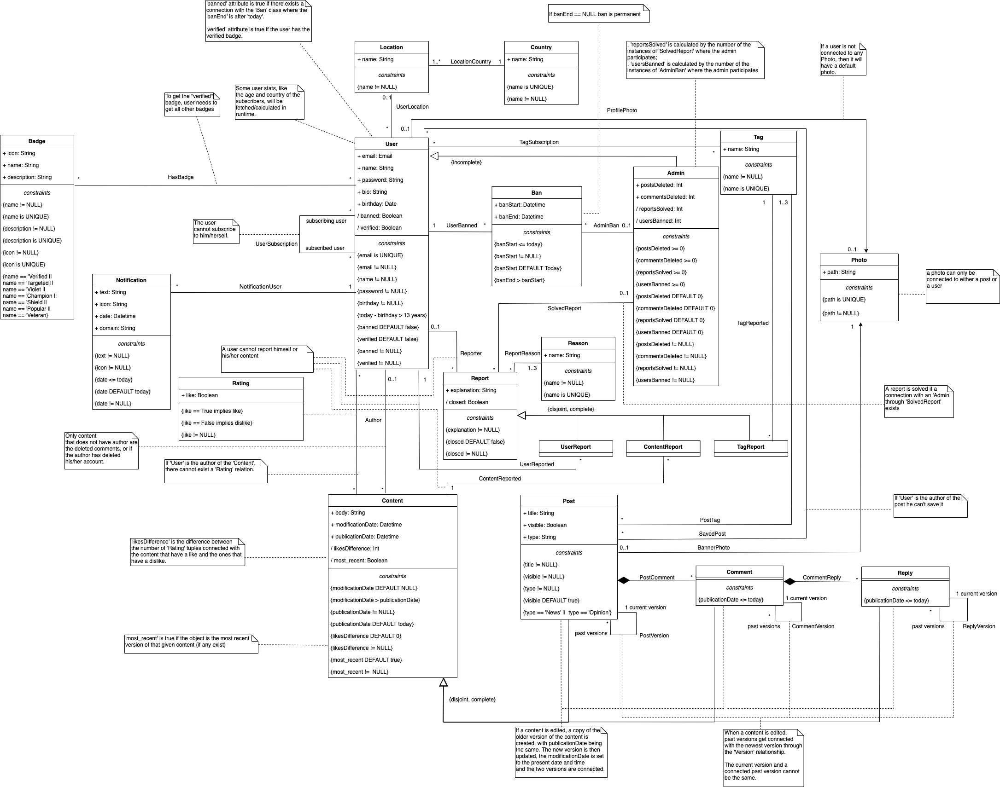

# A4: Conceptual Data Model (Collaborative News)

Our product is called NewsLab. It consists of a collaborative news web application where anyone has the freedom to write and develop news about various topics and read about occurrences all around the world, serving as a platform not only to increase each one's awareness and knowledge about the world but also as a way to unite people and increase communication. It will be designed to create an all-encompassing place where people can write and discuss news in a collaborative manner, centralizing news and perspectives from all over the world allowing users to create a wholesome outlook on whatever subject they like.

The goal of this artifact is to provide a representation of the entities that constitute our system and of the relations between them. This representation is done using UML (Unified Modeling Language) to make it more accessible and readable, as it is a common language among engineers. The conceptual model presented is oriented towards the design of the database that will support the system.

## 1. Class diagram

The following image shows the UML diagrams representing the conceptual model of the database. It contains classes, that represent entities of the system, each having their own attributes, associations and constraints.

> [Original image](https://git.fe.up.pt/lbaw/lbaw1920/lbaw2022/-/blob/master/docs/class-diagram/class-diagram.png)

## 2. Additional Business Rules
 
The additional Business Rules that were specified for this delivery can be seen in the following table. These Business Rules where also added to the Business Rules section in the A2 Artifact.

| Identifier |         Name          | Description |
| ---------- | --------------------  | ----------- |
|    BR15    | Default photos          | If a user or notification is not connected with a photo, they will have a default photo. The posts need to have a banner image. |
|    BR16    | Likes and dislikes of content          | The specific amount of likes and dislikes of a post or comment are only visible by admins, if that content is reported. In all other cases, only the like/dislike difference is visible. |
|    BR17    | Type of a post        | Each post has to belong to one of two types: "News" or "Opinion". |
|    BR18    | Number of tags in a post | A post needs to have between 1 and 3 tags. |

## Revision history

* Added BR17 and BR18 as additional Business Rules
* Updated class diagram - removed NOT NULL restriction from content body, etc
* Added a most_recent attribute to content
* Updated the class diagram: title is not UNIQUE anymore and version explanation in UML notes was changed

***
**GROUP2022, 12/04/2020**

* David Luís Dias da Silva, up201705373@fe.up.pt (Editor)
* Eduardo Carreira Ribeiro, up201705421@fe.up.pt
* Luís Pedro Pereira Lopes Mascarenhas Cunha, up201706736@fe.up.pt 
* Manuel Monge dos Santos Pereira Coutinho, up201704211@fe.up.pt